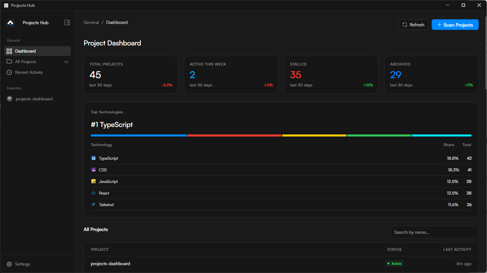

# Project Dashboard 🚀



O **Project Dashboard** é uma ferramenta poderosa para te ajudar a organizar, rastrear e gerenciar todos os projetos de código (repositórios Git) que ficam espalhados pelo seu computador.

Sabe quando você tem dezenas de pastas com testes, projetos antigos, repositórios de clientes, e acaba perdendo a noção do que tem ali? Esse dashboard resolve isso fazendo um scan nas suas pastas e montando um painel bonito e interativo com tudo o que ele encontra.

---

[](https://github.com/GabrielSantos23/projects-dashboard/releases/latest)

## ✨ O que ele faz?

- 🔍 **Auto-Scan de Repositórios**: Você diz em quais pastas seus projetos costumam ficar (ex: `D:\projects`), ele varre os diretórios procurando tudo que tem `.git` e indexa pra você automaticamente.
- 📊 **Metadados Ricos**: O scan vai além do básico. Ele conta os commits, lista os contribuidores, puxa as últimas mensagens de commit, conta branches e rastreia atividades recentes.
- 🛠️ **Reconhecimento de Tech Stack**: Ele lê arquivos como `package.json`, `Dockerfile`, `.csproj`, etc., e deduz quais tecnologias você usou no projeto (ex: React, Node, Docker, C#, Python), criando tags automáticas.
- 📝 **Anotações e Organização**: Cada projeto tem uma página de detalhes onde você pode criar tags manuais, fixar (pinar) seus projetos favoritos, e até mesmo commitar e enviar alterações (push) pro Git diretamente da interface.
- 💻 **Web & Desktop**: Dá pra rodar via navegador ou como um app Windows nativo.
- 🔄 **Auto-Updates**: A versão Desktop verifica atualizações automaticamente e baixa as novas versões direto do GitHub.

---

## 🚀 Como Instalar e Rodar

Você pode usar o Project Dashboard de três formas: baixando o executável pronto, compilando o App Desktop, ou rodando a versão Web.

### 1. Baixar o Release Pronto (Método Mais Fácil)

Se você está no Windows e quer apenas usar o aplicativo sem instalar nenhuma dependência:

1. Vá até a página de [Releases](https://github.com/GabrielSantos23/projects-dashboard/releases) deste repositório.
2. Baixe o arquivo `ProjectDashboard.Avalonia.exe` mais recente ou o formato `ProjectDashboard-win-x64.zip`.
3. Rode o arquivo `.exe`!
4. O app é totalmente autossuficiente, você não precisa nem instalar o .NET para rodá-lo. Além disso, o app vai se auto-atualizar quando novas versões forem lançadas.

### 2. Rodar o App Desktop Avalonia (Pelo Código Fonte)

Se você quer compilar e rodar o aplicativo Desktop você mesmo, garanta que você tem o **.NET 9 SDK** instalado.

```bash
# Clone o repositório e vá para a pasta
git clone https://github.com/GabrielSantos23/projects-dashboard.git
cd projects-dashboard

# Rode o projeto Desktop (Avalonia)
dotnet run --project Src/DesktopAvalonia/ProjectDashboard.Avalonia.csproj
```

### 3. Rodar a Versão Web (Ruby on Rails)

Se você prefere a interface no navegador, a versão Ruby on Rails 8 está disponível. Certifique-se de que tem o **Ruby** instalado.

```bash
# Navegue até a pasta do painel web
cd Src/WebRails

# Instale as dependências (somente na primeira vez)
bundle install
ruby bin/rails db:prepare

# Inicie o servidor local
ruby bin/rails server
```

O Dashboard Web ficará disponível em `http://localhost:3000`.

---

## 💡 Como usar

1. Logo que abrir o app, a sua lista de projetos estará vazia. Clique no botão **Scan Projects**.
2. Na seção de pastas, clique em **Browse** (no Desktop) para selecionar a pasta raiz onde ficam seus repositórios (ex: `C:\Users\gabs\Documentos\GitHub`).
3. Clique em **Add Folder**, depois em **Start Scan**.
4. O app vai varrer todas as pastas buscando projetos com Git, ignorando pastas pesadas (como `node_modules` ou `bin`) para ser bem rápido.
5. Pronto! Agora você pode explorar seus projetos no dashboard.
6. Clique em qualquer card de projeto para abrir o **Menu de Detalhes**, onde você pode gerenciar tags customizadas, aplicar Tags do Git, ou até mesmo fazer o _stage_ e criar _commits_ de código diretamente.
7. Seu banco de dados fica salvo de forma segura e local na sua máquina.
8. Use o botão **Refresh** nas páginas para escanear instantaneamente as pastas de novo e atualizar a lista com os últimos commits e novos projetos.

---

## 🤝 Quer contribuir?

Sinta-se livre para abrir _issues_ se o scanner travar em alguma pasta ou enviar um _pull request_ melhorando a lógica de detecção de tecnologias. Toda ajuda é super bem-vinda!
